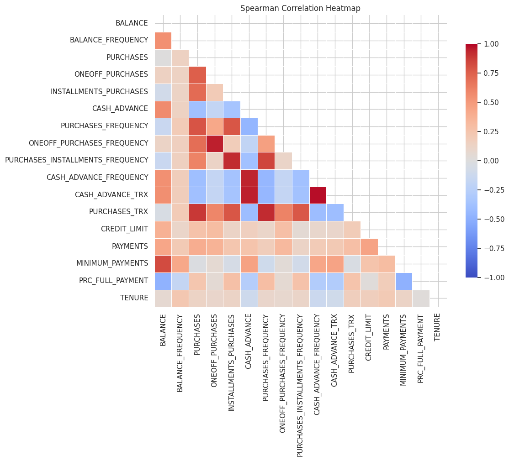
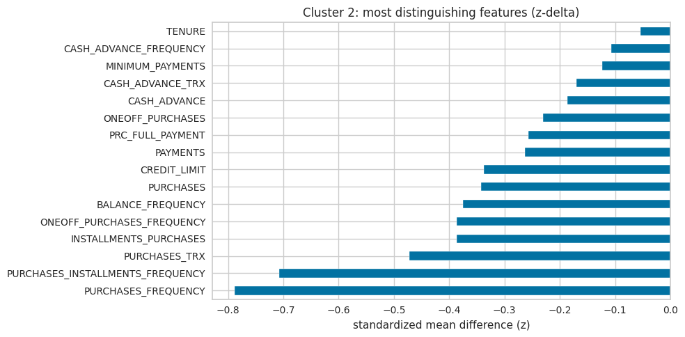

# Credit Card Customer Behavior Segmentation & Analysis
Customer segmentation using 6-month credit card usage features (Data Cleaning and Processing → EDA → PCA → K-Means → Cluster Profiling) to derive actionable customer groups.

## Dataset Introduction
This is a dataset for developing a customer segmentation. The dataset summarizes the usage behavior of active credit card holders during the last 6 months. The file is at a customer level with 18 behavioral variables.

- BALANCE: Balance amount left in their account to make purchases.
- BALANCE_FREQUENCY: How frequently the Balance is updated, score between 0 and 1 (1 = frequently updated, 0 = not frequently updated).
- PURCHASES: Amount of purchases made from account.
- ONEOFF_PURCHASES: Maximum purchase amount done in one-go (i.e., one-time payment for a purchase).
- INSTALLMENTS_PURCHASES: Amount of purchase done in installment (i.e., multiple payments for a purchase). Observation: PURCHASES = ONEOFF_PURCHASE + INSTALLMENT_PURCHASES).
- CASH_ADVANCE: Cash in advance given by the user (a cash advance is when taking money out of the ATM using credit card instead of debit card or ATM card).
- PURCHASES_FREQUENCY: How frequently the Purchases are being made, score between 0 and 1 (1 = frequently purchased, 0 = not frequently purchased).
- ONEOFF_PURCHASES_FREQUENCY: How frequently Purchases are happening in one-go (1 = frequently purchased, 0 = not frequently purchased).
- PURCHASES_INSTALLMENTS_FREQUENCY: How frequently purchases in installments are being done (1 = frequently done, 0 = not frequently done).
- CASH_ADVANCE_FREQUENCY: How frequently the cash in advance being paid.
- CASH_ADVANCE_TRX: Number of Transactions made with "Cash in Advanced".
- PURCHASES_TRX: Number of purchase transactions made.
- CREDIT_LIMIT: Limit of Credit Card for user.
- PAYMENTS: Amount of payment done by user (i.e., payment for the use of credit card)
- MINIMUM_PAYMENTS: Minimum amount of payments made by user.
- PRC_FULL_PAYMENT: Percent of full payment paid by user.
- TENURE: Tenure of credit card service for user (i.e., how long (in months) you should have held the credit card before they will grant you credit).

## Skills (Techniques Applied)
- Data cleaning & validation (missing values, duplicates, consistency checks)
- EDA: distribution analysis, skew/outliers, log1p visualization
- Correlation: Spearman vs Pearson; feature-family redundancy
- Scaling: StandardScaler / RobustScaler
- PCA: variance explained + 2D/3D projections
- Clustering: K-Means (`random_state`, `n_init`)
- Evaluation: inertia, silhouette score
- Cluster profiling: mean/median + **z-delta** (standardized difference vs overall)
- Insight delivery: segment personas and recommendations

## Goals
- Segment customers based on behavioral patterns.
- Identify key drivers that differentiate each segment.
- Deliver business-readable personas for targeting and strategy.

## Workflow
1. Data cleaning and basic checks  
2. Distribution analysis (skew, outliers; log-scale views)  
3. Correlation analysis (Spearman heatmap + top pairs)  
4. PCA (variance explained, 2D/3D visualization)  
5. K-Means clustering (K=4)  
6. Cluster evaluation (inertia, silhouette)  
7. Cluster profiling (z-delta heatmap + per-cluster drivers)  
8. Segment personas + actionable insights  

## Data Insights
### Feature Distribution Overview

  

- **Heavy right-skew & outliers:** Monetary features (e.g., `BALANCE`, `PAYMENTS`, `CREDIT_LIMIT`) show long right tails, meaning a small number of customers have very large values.
- **Zero-inflation / non-usage behavior:** Many activity features have a large spike at **0** (e.g., `PURCHASES`, `ONEOFF_PURCHASES`, `INSTALLMENTS_PURCHASES`, `CASH_ADVANCE`, `CASH_ADVANCE_TRX`), suggesting a sizable group of customers rarely/never uses those behaviors.
- **Log1p makes spending behavior clearer:** After applying `log1p` to skewed amount/count variables, several distributions become more “bell-shaped,” making typical customer behavior easier to observe (instead of being dominated by extreme values).
- **Frequency features are polarized:** Several `*_FREQUENCY` variables (0–1) show mass near **0** and/or **1**, indicating many customers either use the card **very rarely** or **very consistently** rather than evenly spread usage.
- **Cash advance behavior is uncommon for most:** `CASH_ADVANCE_FREQUENCY` is concentrated near **0**, implying most customers rarely take cash advances.
- **Full payment tendency is mostly low:** `PRC_FULL_PAYMENT` is heavily concentrated near **0**, suggesting many customers do not frequently pay the full balance (with a smaller group closer to full payment).
- **TENURE is concentrated at 12 months:** Most customers have `TENURE = 12`, so tenure provides limited separation compared to transactional/spending behaviors.

### Correlated Data Features Exploration using "Spearman Correlation Heatmap"

  

- Purchase metrics (`PURCHASES`, `PURCHASES_TRX`, `PURCHASES_FREQUENCY`) strongly move together, capturing overall spending activity.
- Cash-advance metrics (`CASH_ADVANCE`, `CASH_ADVANCE_TRX`, `CASH_ADVANCE_FREQUENCY`) also move together, representing cash-advance behavior intensity.
- Higher `BALANCE` aligns with higher `MINIMUM_PAYMENTS`, indicating revolving balance relates to repayment obligation.
- `PRC_FULL_PAYMENT` generally contrasts with balance/cash-advance behavior (customers paying in full tend to carry lower revolving/cash-advance patterns).

## Segment Drivers (z-delta)

**z-delta (standardized difference)** = (cluster mean − overall mean) / overall std.  
Positive = higher than typical customer, negative = lower.

  

### Cluster personas (high-level)
- **Cluster 0 — Frequent Transactors:** high purchase frequency/transactions, low cash advance, lower balance.
- **Cluster 1 — High-Value Spenders:** highest purchases/transactions and payments, higher credit limit, low cash advance.
- **Cluster 2 — Low-Usage / Inactive:** below-average activity across most behaviors.
- **Cluster 3 — Cash-Advance Heavy / Revolvers:** high cash advance + balance/min payments, lower full-payment tendency.

  
Show per-cluster driver charts

  

    
  

  

    
  

  

    
  

  

    
  

## Credit-Card Service Strategy (by Segment)

- **Cluster 1 – High-Value Spenders:** retain & grow via premium rewards, tailored offers, and credit-line optimization (risk-checked).
- **Cluster 0 – Frequent Transactors:** increase basket size with transaction milestones, installment offers, and category-based promotions.
- **Cluster 2 – Low-Usage / Inactive:** activation campaigns (first purchase bonus), onboarding improvements, and churn-prevention offers.
- **Cluster 3 – Cash-Advance Heavy / Revolvers:** reduce risk using autopay/reminder tools, repayment options, fee transparency, and tighter cash-advance controls.

**KPIs:** spend growth, transaction frequency, activation/retention, cash-advance rate, balance trend, payment regularity.

